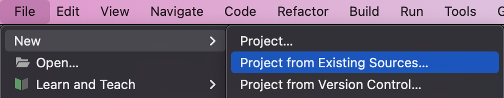
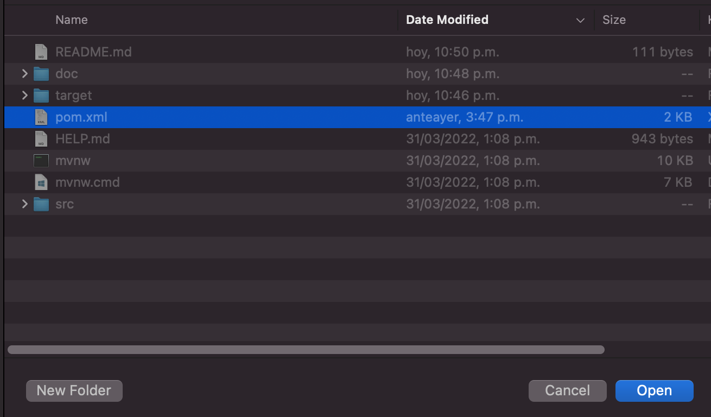
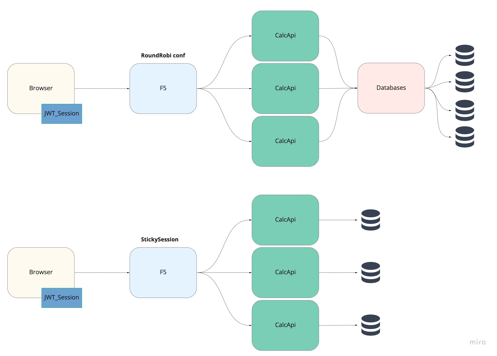
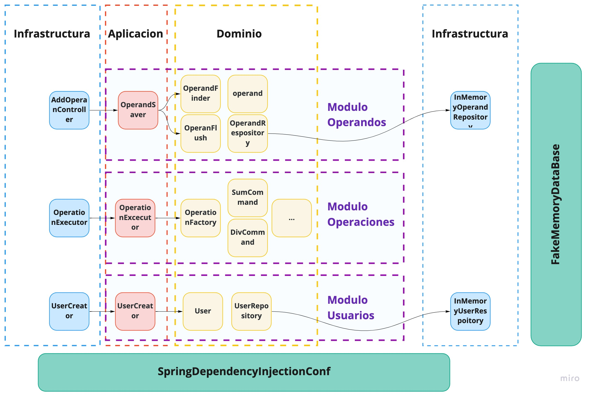

## Como importar el proyecto

Crear nuevo proyecto desde archivos existentes


Buscar y seleccionar el archivo pom.xml y abrir 


## Generar el proyecto
```shell
mvn clean install
```

## Ejecutar el proyecto

El proyecto es un proyecto de SpringBoot, para ejecutarlo
es necesario saber la ruta donde se encuentra el jar.

Después del comando anterior el ejecutable se puede encontrar
en ./target/calc-1.0.0-SNAPSHOT.jar
```shell
java -jar ./target/calc-1.0.0-SNAPSHOT.jar
```

este comando levanta un tomcat embebido en el puerto 8080.

## Pruebas sobre la API

las pruebas se pueden realizar con Postman, se comparte una collection
en la carpeta ./PostmanCollection

## Ejecución de los casos de prueba
```shell
mvn test
```

## Alta disponibilidad, concurrencia, escalabilidad y elasticidad
Para lograr la concurrencia se debe implementar los repositorios para algún
motor de base de datos. Esto sumado al uso de servicios transaccionales
van a permitir que la app se pueda consumir de forma concurrente.
Actualmente y para lograr la concurrencia con la base de datos en memoria
se usan bloqueos de métodos (synchronized), de esta forma se permite una
pseudo concurrencia.

La escalabilidad se puede lograr separando los módulos en apps diferentes
y poniendo por delante un api-gateway por ejemplo. Llevando esta solución
a micro servicios e implementando un bus para los eventos de dominio.

Esta solución no mantiene un estado en el aplicativo por lo que la alta
disponibilidad se puede lograr habilitando diferentes caminos
que estarían balanceados. La persistencia en base de datos facilita
este proceso.

Al no tener un estado la elasticidad tampoco es un problema, se van
a poder levantar contenedores de la app bajo demanda sin ningún
inconveniente.


# Solución
Esta solución esta construida usando arquitectura exagonal.

Mediante el uso de patron repository se mantiene separada la
implementación de base de datos del funcionamiento del modelo.

Se usa el patron Command para las operaciones y el patron Factory
para la construcción de los comandos.



# Oportunidades de Mejora
* Faltan test de integración
* Mejorar el manejo de usuarios:
  * los usuarios se mantienen en memoria todo el ciclo de vida de la app
    si se hace un mejor manejo se pueden borrar cuando se venza la sesión
  * Si se usa base de datos el problema es peor, para resolverlo se pude
    usar un marcado de fecha y hora de la ultima operación y luego crear
    un batch que vaya limpiando
  * Si se manejan sesiones, cuando se venza la sesión se puede disparar un
    evento que borre los datos del usuario.
* Se puede mejorar el manejo de errores que se envían por http
* La api se puede definir con open api
* Se puede realizar sanitization de los parámetros de entrada
* Se puede implementar token para CSRF.


